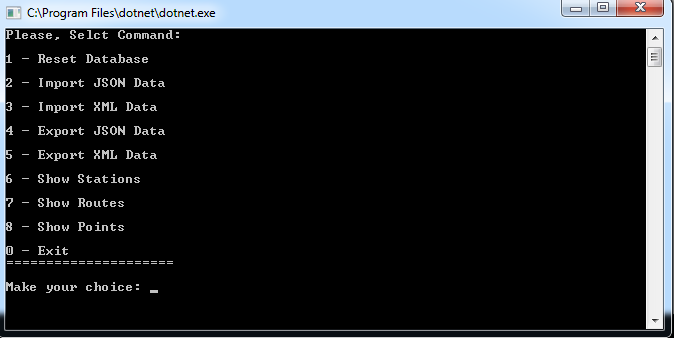
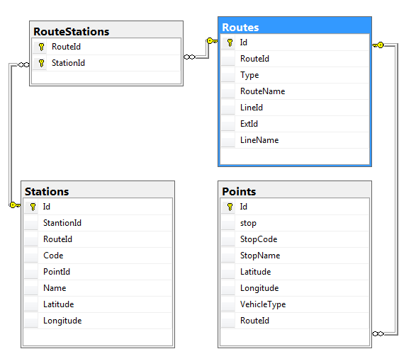

# Metro

I’ve created this project to practice Entity Framework Core. 
What does it do?
Starts console application that will build the database and import / export data from JSON / XML. As last feature you can query the table to verify successful import of the data. 

Here is the database diagram for reference: 

